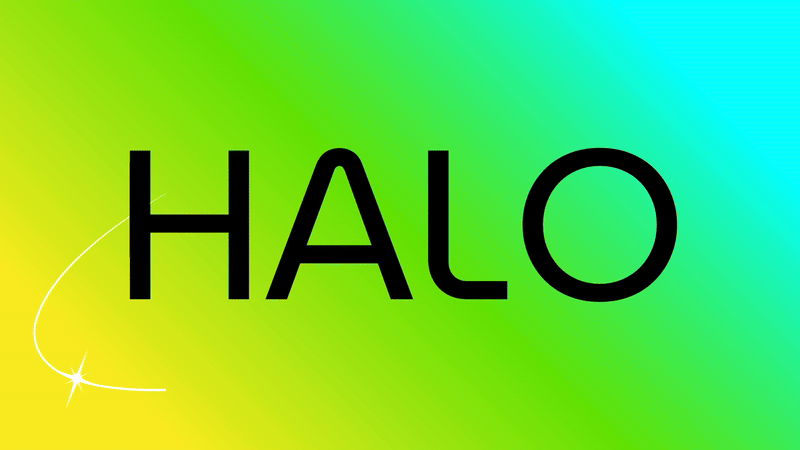

# Halo: AI-Powered Accessibility Extension  



**Halo** is a Chrome (Manifest V3) extension that makes the web safer and easier to read.  
It combines **real-time photosensitive epilepsy protection** with **AI-powered reading assistance** for people with ADHD, dyslexia, and other reading challenges — built entirely in **vanilla JavaScript**, zero dependencies, and 100% local privacy.  

---

## Key Features  

### Photosensitive Epilepsy Protection  
- **Real-time flash detection** on YouTube (including Shorts), TikTok, Twitter/X, Instagram, and Twitch  
- Fully **WCAG 2.1-compliant luminance algorithm** with proper gamma correction (≥ 3 flashes/sec threshold)  
- **Instant auto-pause** with full-screen warning overlay displaying frequency, count, and timestamp  
- **Session analytics** — tracks videos monitored, warnings issued, and total flashes detected with anti-inflation logic
- **Zero false positives** via dual brightness checks, warm-up periods, and intelligent threshold filtering
- All video analysis **runs entirely in-browser** — no external data transmission

### AI Reading Assistance  
- **One-click text extraction** — "Auto-Fill from Page" button intelligently pulls article content from any webpage
- **4-tier fallback extraction** — semantic HTML → common containers → text density heuristics → universal paragraph collection
- Works seamlessly on Medium, Wikipedia, news sites, blogs, and any properly structured content
- **Google Gemini 2.0-flash summarization**  
  - *Quick Summary*: 2–3 sentence distillation for rapid comprehension
  - *Bullet Summary*: 3–5 scannable key points  
- **Real-time character tracking** with 15,000 character processing limit
- **Instant clipboard copy** and **timestamped .txt downloads**
- **5 ambient soundscapes** - Enables users to play calming background audio while reading
- Designed for ADHD, dyslexia, and information processing challenges — useful for everyone

### Text-to-Speech with 10 Voice Personalities  
Powered by **ElevenLabs multilingual v2** with studio-quality synthesis

Integrated HTML5 player with full playback controls, auto-play on generation, and collapsible interface.

Runs through Manifest V3 **offscreen document** for persistent background playback at 30% volume. Preferences persist across sessions.

### Dual-Mode Interface  
- **Compact 400px popup** — quick access, instant toggles, live statistics
- **Full-page web app** (via rocket icon 🚀) — extended sessions with enhanced controls
  - Keyboard shortcuts (Ctrl/Cmd + Enter to generate)
  - Multi-layer glowing result display
  - Copy, Download, Listen action buttons
  - Professional gradient layout with feature grid
- **Configurable settings modal** for API keys (Gemini + ElevenLabs)
- **Smart audio controls** with smooth reveal animations

---

## Tech Stack  

| Layer | Implementation |
|-------|----------------|
| Core | **Vanilla JavaScript (ES6+)**, HTML5, CSS3 — zero build dependencies |
| Platform | **Chrome Manifest V3**, Canvas API, Storage API, Offscreen API, Tabs API, Scripting API |
| AI | **Google Gemini 2.0-flash** (summarization), **ElevenLabs v2** (text-to-speech) |
| Architecture | Service Worker ↔ Content Scripts ↔ Popup ↔ Offscreen Document with message-based IPC |
| Storage | Dual-layer sync + local with promise-queue serialization for race-condition safety |
| Video Analysis | Canvas-based frame capture with true WCAG luminance math and gamma correction |

---

## Installation  

```bash
git clone https://github.com/athulya-anil/halo.git
cd halo
```

1. Navigate to `chrome://extensions/`
2. Enable **Developer mode** (top-right toggle)
3. Click **Load unpacked** → select the `halo/` folder
4. **Flash protection activates immediately** (no configuration needed)
5. **For AI features:** Open extension → Settings → add API keys:
   - [Gemini API Key](https://aistudio.google.com/) (required for summarization)
   - [ElevenLabs API Key](https://elevenlabs.io/) (optional for TTS)
   
---

## Technical Highlights  

### Flash Detection Engine
**WCAG 2.1 Implementation with Production-Grade Optimizations:**

- **True luminance calculation** — sRGB → linear RGB gamma correction (2.4 exponent) → WCAG weighted formula (0.2126R + 0.7152G + 0.0722B)
- **Intelligent sampling** — analyzes every 3rd frame, samples every 4th pixel, caps at 640×360 resolution for 12-48x performance gain
- **False-positive elimination:**
  - Dual brightness thresholds (ignores frames <5%, requires consecutive frames >5%)
  - 10-frame warm-up period skips initialization artifacts
  - Minimum 10% absolute luminance delta required
  - Dark scene transitions intelligently filtered
- **Platform-specific handlers:**
  - YouTube standard + Shorts (`/shorts/VIDEO_ID` path detection)
  - TikTok, Twitter/X, Instagram, Twitch with SPA navigation support
- **Dynamic discovery** — MutationObserver with 500ms throttling auto-detects video injections

**Warning System:**
- Instant video pause on detection (≥3 flashes/second threshold)
- Full-screen modal with blur backdrop, pulsing icon, slide-in animation
- Detailed metrics: frequency, peak rate, total count, exact timestamp
- Smart reset logic — clears warnings on seek to <10s, persists on forward seeks
- Session statistics with cross-tab state synchronization
- AI voice alert (can be turned on/off)

### Text Extraction Pipeline
**4-Tier Intelligent Fallback Architecture:**

```
1. Semantic HTML        → <article> tags
2. Common Patterns      → .article-content, .post-content, [role="article"], etc.
3. Density Heuristics   → score = paragraphs.length × textLength (finds content-rich nodes)
4. Universal Fallback   → all <p> elements >50 characters
```

Semantic cleaning removes navigation, headers, footers, sidebars, and promotional content while preserving article structure. Works universally on Medium, Wikipedia, news sites, and any properly marked-up HTML.

### AI Integration
**Gemini 2.0-flash with prompt-engineered outputs:**
- Character-aware processing (15,000 limit with live counter)
- Markdown stripping post-processor (removes `**`, `__`, converts `*` → `-`)
- Mode-specific prompts optimized for conciseness vs. detail
- API key encryption via Chrome's native storage layer

**ElevenLabs TTS with 10 voice profiles:**
- Stability: 0.5, Similarity Boost: 0.75 for natural delivery
- MP3 blob streaming with HTML5 player integration
- Configurable voice selection persists across sessions

### Audio Architecture
**Manifest V3 Compliant Background Playback:**
- Offscreen document handles persistent audio (survives popup close)
- Service worker routes control messages to offscreen context
- 30% default volume, seamless looping, instant sound switching
- Expansion-ready for 5-sound library (meditation, nature, ocean, rain, white noise)

### State Management & Reliability
**Race-Condition Prevention:**
- Promise-queue serialization for statistics updates (prevents concurrent write conflicts)
- Dual storage strategy — local for speed, sync for persistence
- Visited video tracking with Set-based deduplication (cross-session)
- Storage-loaded flag gates initialization until state hydration completes

**Graceful Degradation:**
- Extension context invalidation detection with silent fallback
- CORS error suppression for cross-origin videos (logs once, continues operation)
- MutationObserver throttling prevents DOM thrashing on heavy SPAs
- YouTube Shorts special-case routing (path-based ID extraction)

---

## Privacy & Security  

- **Local-first processing** — all video frame analysis and text extraction happen in-browser
- **User-initiated AI calls** — no automatic data transmission; Gemini/ElevenLabs requests only on explicit action
- **Encrypted storage** — API keys stored via Chrome's secure storage APIs
- **Zero telemetry** — no analytics, tracking pixels, or third-party cookies
- **HTTPS-only** external requests with CSP compliance

---

## Accessibility Compliance  

**WCAG 2.1 Adherence:**
- Semantic HTML structure with proper landmark roles
- Keyboard-navigable UI with visible focus indicators
- High-contrast color scheme (4.5:1+ ratios)
- Large touch targets (40px minimum)
- Screen-reader compatible with ARIA labels
- `prefers-reduced-motion` media query support (disables animations)

---

## Performance Metrics  

**Video Analysis Optimizations:**
- Frame sampling (every 3rd) + pixel sampling (every 4th) = 12x speedup
- Canvas downscaling to 640×360 = 4x data reduction
- Brightness pre-check gates luminance calculation = 2-3x conditional speedup
- **Combined: 12-48x faster than naive per-frame, per-pixel RGB analysis**

**Content Extraction:**
- Early-exit strategy (stops at first viable match)
- Cloned DOM manipulation (non-blocking, doesn't affect page)
- Filtered selectors (specific → general for minimal DOM traversal)

**Storage:**
- Promise-queue batching for write coalescing
- Local cache for hot-path reads (statistics dashboard)
- Lazy offscreen document creation (only when audio enabled)

---

## Team  

Built by:
- [**Balachandra DS**](https://github.com/Baluds)
- [**Athulya Anil**](https://github.com/atl-007)
- [**Allen Joe Winny**](https://github.com/atl-007)

Created for **HackUMass XIII (2025)**.  

*Inspired by a simple belief — the internet should be safe and inclusive for everyone.*

---

## License  

[MIT License](LICENSE)

---

## Links  

- **Documentation:** [GitHub Repository](https://github.com/athulya-anil/halo)
- **Issues & Support:** [GitHub Issues](https://github.com/athulya-anil/halo/issues)
- **Gemini API:** [Get API Key](https://aistudio.google.com/)
- **ElevenLabs API:** [Get API Key](https://elevenlabs.io/)
- **WCAG Guidelines:** [W3C Accessibility](https://www.w3.org/WAI/WCAG21/quickref/)
